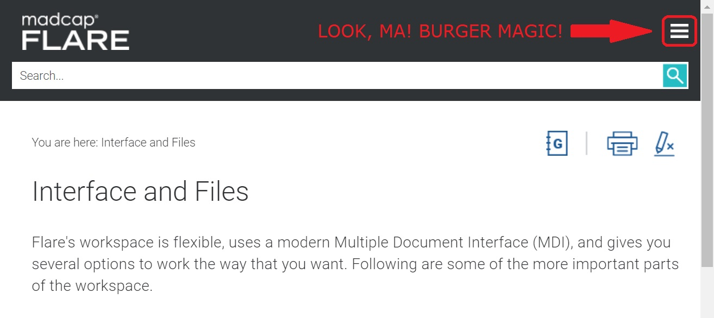

# Documentation Compared: Atlassian’s Jira & Confluence vs. MadCap Flare

## Contents

1. [Introduction](#introduction)  
2. [First impressions](#first-impressions)  
   2.1. [Jira & Confluence](#jira--confluence)  
   2.2. [MadCap Flare](#madcap-flare)
3. [Technicalities](#technicalities)  
   3.1. [Jira & Confluence](#jira--confluence-1)  
   3.2. [MadCap Flare](#madcap-flare-1)
4. [Content structure & accessibility](#content-structure--accessibility)  
   4.1. [Jira & Confluence](#jira--confluence-2)  
   4.2. [MadCap Flare](#madcap-flare-2)
5. [Content quality](#content-quality)  
   5.1. [Jira & Confluence](#jira--confluence-3)  
   5.2. [MadCap Flare](#madcap-flare-3)
6. [Conclusion](#conclusion)  
    6.1. [Comparison chart](#comparison-chart)

## Introduction

The purpose of this article is to share my thoughts[^1] on documentation for three software products: **Jira**, **Confluence**, and **Madcap Flare**.

Jira is a popular project management tool developed by Atlassian. Confluence is a web-based corporate wiki and another successful product from the same company. Flare, developed by the eponymous MadCap firm, is a major help authoring tool used by technical writers all over the world.

In this comparison, I treat Atlassian's tools and their corresponding documentation as one. The reason for this is that Jira and Confluence are often used in unison, as parts of a greater ecosystem. They integrate seamlessly with each other and so does their documentation. If I were to compare them, I'd probably repeat myself a lot.

## First impressions

The importance of first impressions is well-documented with respect to building rapport, but it is no less relevant in the virtual world. According to [Peep Laja from CXL.com](https://cxl.com/blog/first-impressions-matter-the-importance-of-great-visual-design/):

> It takes about 50 milliseconds (ms) (that’s 0.05 seconds) for users to form an opinion about your website that determines whether they’ll stay or leave.

Now, a user with a serious issue to solve will likely not "rage-quit" a website after 50 milliseconds, but a well-designed layout certainly helps to create a good overall impression of the product and the people behind it.

### Jira & Confluence

My first impression of Atlassian's support page was great. Yes, I'm partial to minimalistic designs and shades of blue, but this level of clarity rises above subjective measures:  


As mentioned earlier, documentation of Confluence is confusingly similar, and both tools share basically the same website/ knowledge base, as well as the layout:


There are no unnecessary animations or ads, so the interface feels snappy even on my older, laggy computer. Icons are intuitive, search boxes easy to spot, and everything looks professional.

### MadCap Flare

As I looked at MadCap's main help page, my enthusiasm faltered:


It's not bad by any means. It's still simple, sparse in decoration, and functional above all else. It just looks less *fun*, more serious, and a bit old-fashioned.

I'm slightly put off by the search box occupying most of the screen, in favor of the TOC squeezed to the side. I hope that the content is well-structured and that the robust search panel is not there to overcompensate for unintuitive architecture. Let's not speak too soon.

## Technicalities

More to the point, we will now focus on technical aspects of online documentation: how well the websites work, how they scale and arrange content on different devices, and how convenient the interface is.

### Jira & Confluence

The top navigation bar is `position: relative` with respect to the main container, so it disappears when you scroll down. It's not a problem, since most articles are short and don't span far downwards. Still, I would appreciate having the menu at hand at all times.

I was disappointed with the search UI. Clicking on the familiar icon, I expected an input field to expand. What a surprise! I was redirected to a separate search page instead. There, I typed random things and got confused further. The results included articles dedicated to Atlassian's tools and services other than Jira, like Bitbucket or Opsgenie, to name a few. Luckily, there is an option to filter results by product. Still, linked through the Jira page, I would expect the right filter to be applied by default. This does happen, but only if you access the search through Jira's documentation homepage.


The content scales very well on mobile devices and lower resolutions. A quick peek at the code reveals that [Flexbox](https://css-tricks.com/snippets/css/a-guide-to-flexbox/) and [media queries](https://www.w3schools.com/css/css_rwd_mediaqueries.asp) keep everything in check:

```CSS
@media only screen and (min-width: 361px) and (max-width: 767px) {
  main .main-content-wrapper {
    display: -webkit-box;
    display: -webkit-flex;
    display: -moz-box;
    display: -ms-flexbox;
    display: flex;
    -webkit-box-orient: horizontal;
    -webkit-box-direction: normal;
    -webkit-flex-flow: row wrap;
    ...
  }
```
This makes modules from the right column (e.g. "Explore more", see below) wrap to the bottom whenever you view the page at screen width lower than 767px.


Atlassian collects feedback via "Was this helpful?" element, placed under each article. Usually I hate those and I'll just click "No" when frustrated (as I'm sure many of you do too), but the buttons here are out of sight and don't bother me.


### MadCap Flare

Flare's navigation bar is `fixed` to the top of the viewport, so you always see it when scrolling. Unlike on Atlassian's websites, MadCap's search icon comes with an input field. It's very convenient, even though the navigation bar obstructs the view slightly at lower resolutions. On a side note, I'd love more web designers to use [a sticky header that hides on scroll](https://webdesign.tutsplus.com/tutorials/how-to-hide-reveal-a-sticky-header-on-scroll-with-javascript--cms-33756) – the best of both worlds, in my opinion.

MadCap's website also uses Flexbox[^2] to wrap elements when scaling, and it does scale very well. I like how the left-hand interface collapses to a hamburger icon when you browse in window mode.

  



Worthy of note is a little arrow that pops up in the bottom right corner as you scroll down. When clicked, it sends you to the top of the page. MadCap's articles are pretty extensive, so the button comes in handy.


Flare's search engine returns Flare-related results only, and it works well. I haven't had hands-on experience with the app yet, but while typing through some generic records I could easily find what I was "looking for".

## Content structure & accessibility

In this section, I address structuring and accessibility. By structuring, I mean how well-organized the content is and how its architecture translates to the ease of use. Users should be able to navigate through sections quickly and intuitively. They should know where they are at a given moment, and how they can get back to their previous position. Accessibility refers to how unrestrictive the website is in terms of who can use its content (e.g. translation options or screen readers compatibility).

### Jira & Confluence

Atlassian's layout maintains a healthy balance between clarity of content and transparency of architecture. Why can't have both? It's simple: big numbers of articles and nested subsections lead to complex tree structures. These, when displayed all at once, would make for a TOC vast enough to fill up the whole screen. Conversely, hiding the structure altogether could cause users to get lost. They would switch pages back and forth to determine where they are. Hence, balance is the key.


Above, you see the main support page for Confluence. From there, we'll access "Navigate around Confluence".


As you can see, the general TOC disappears when you enter a section. On the right, only the current parent directory ("Create and organize work in Confluence Cloud") and its subsections are listed. This much information is more than enough to stay on track without obscuring the view. Additionally, your current position is marked with a dot. Overall, the design is very readable.

Should you not find the answers you are looking for, click on "Ask the community" button at the bottom. It will redirect you to the users' forum, where you can voice your issues.

For those who don't speak English, Atlassian offer their website in twelve other languages. The problem is that not all the content is translated, and it can be hit or miss depending on where and how deep you delve. For example, introductory pages, feature presentations, and short tutorials are all translated into Polish, but clicking on *Dokumentacja → Dowiedz się więcej* redirects to the English documentation. This is quite unexpected and happens in many different places on the website. The translation thus lacks some consistency. On a positive note, the software itself is regularly tested for compatibility with different browsers and screen readers, and I assume their documents pass similar tests too.

### MadCap Flare

Madcap's information structure looks cluttered and a bit overwhelming. The full TOC is displayed on the side and takes lots of space. The top menu is fixed and also limits your viewing area. On bigger screens, however, this shouldn't be an issue. The situation also improves on mobile devices, with TOC collapsing to a button. 


Your current position is marked in bold. You can also see the directory path above the article.

Unfortunately, MadCap doesn't offer any translation options – Flare's documentation is only available in English.

## Content quality

This section covers the quality of content in terms of grammatical correctness, punctuation, style, etc. High quality textual content is pleasant to read, unambiguous, and consistent. It adheres to one particular style guide throughout the whole documentation. Instructions are clear, concise, and comprehensive.

### Jira & Confluence

I believe the key to delivering consistently good content is strict adherence to a well-thought-out style guide. Atlassian seems to share my sentiment. Their [Design System](https://atlassian.design/) is the ultimate guide to writing guides. Under the [Content](https://atlassian.design/content) tab, they cover fine details regarding style, grammar, and punctuation – from bullet points to inclusive language. Judging by what I've read so far, Atlassian's scribes do comply. The docs are written properly, with style, and with love for serial commas.

### MadCap Flare

MadCap's documentation, forgive the pun, lacks a bit of flair. It is still extremely professional, of course – as you'd expect from authors of a popular HAT. Stylistically, though, it doesn't quite measure up to Atlassian, in my opinion. I've also spotted some minor mistakes:

>The IFrame essentially nests a web page into another web page as HTML content, as long as there is not a security setting on the domain preventing it from **displaying**.

**\*being displayed**. *Display* is strictly transitive. I don't like the fact that mistakes like this [eventually become standard practices](http://www.techwr-l.com/archives/9508/techwhirl-9508-01408.html#.YZdi506Sk2w).

Speaking of practices:

>Keep in mind that there are best practices, or recommendations, here and there. However, there is no universal best practice for designing your architecture. What might be best for one author or writing team, **but** not be best for others.

An oversight a quick proofreading would have solved.

I couldn't establish whether MadCap have their own style guide or not. Perhaps just General American or PA. Nothign as fancy as Atlassian's Design, for sure.  However, make no mistake: language-wise, their documentation is still well-written. It also seems clear and easy to follow. I'm just being nitpicky here.

## Conclusion

All in all, I prefer the documentation for Jira & Confluence, but it wins in my book only by a narrow margin. Note that I'm biased too – I use Atlassian's products myself, and I'm freshly impressed with their Design System. My only gripe is that their tools and the corresponding docs are difficult to tell apart. Sometimes I switch between Jira and Confluence and lose track of which was which. Their documentation gives off a similar vibe. Still, I would say Atlassian just about edges Flare in a few aspects. I don't like MadCap's writing style as much, their website has a slightly awkward layout and structure in some places, and there is no localization for other languages. Atlassian: 1, MadCap: 0, then.

### Comparison chart

The chart below is a visual representation of my main points and impressions I described in detail above.

|                           | Jira & Confluence | Madcap Flare     |
|:--------------------------|:-----------------:|:----------------:|
| First impressions         | very good         | good             |
| Technicalities            | good              | good             |
| Structure & accessibility | good              | could be better  |
| Content quality           | very good         | good             |

---

[^1]: Well, this, and also to complete a university assignment – for two different class instructors, at that!
[^2]: I know, I keep mentioning it as if it hasn't been the standard for years now. But hey, how would I *flex* with Markdown's code block syntax otherwise?
